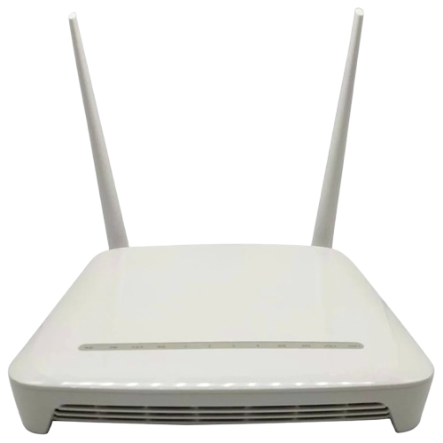

# Fake F670L (HS-2) Reverse Engineering

## Device Overview

This is not exactly a F670L modem, but rather an H2-2 modem with the following specifications:
- **SoC:** ZX279128
- **RAM:** 512MB DDR
- **WiFi:** Dual-band (2.4GHz and 5GHz)

**Note:** The WiFi performance on both bands is significantly limited due to outdated WiFi SoC technology.

## Partition Layout

| Start Address    | End Address      | Partition Name   |
|------------------|------------------|------------------|
| 0x000000000000   | 0x000010000000   | whole flash      |
| 0x000000000000   | 0x000000200000   | u-boot           |
| 0x000007500000   | 0x000007900000   | parameter tags   |
| 0x000000200000   | 0x000003400000   | kernel0          |
| 0x000003400000   | 0x000006600000   | kernel1          |
| 0x000006600000   | 0x000007000000   | usercfg          |
| 0x000007000000   | 0x000007100000   | others           |
| 0x000007100000   | 0x000007500000   | wlan             |
| 0x00000fc00000   | 0x000010000000   | GN25L95_datas    |

> **Note:** Set_Trap_Pkt_Pps_Limit is NULL.

## Configuration Decryption and Encryption

> [!NOTE]
> Decryption is functional. Encryption functionality is currently in development.
